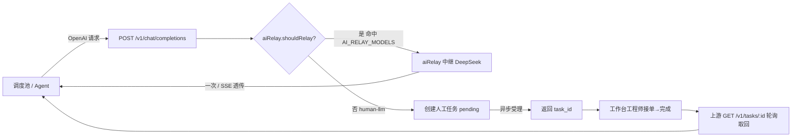
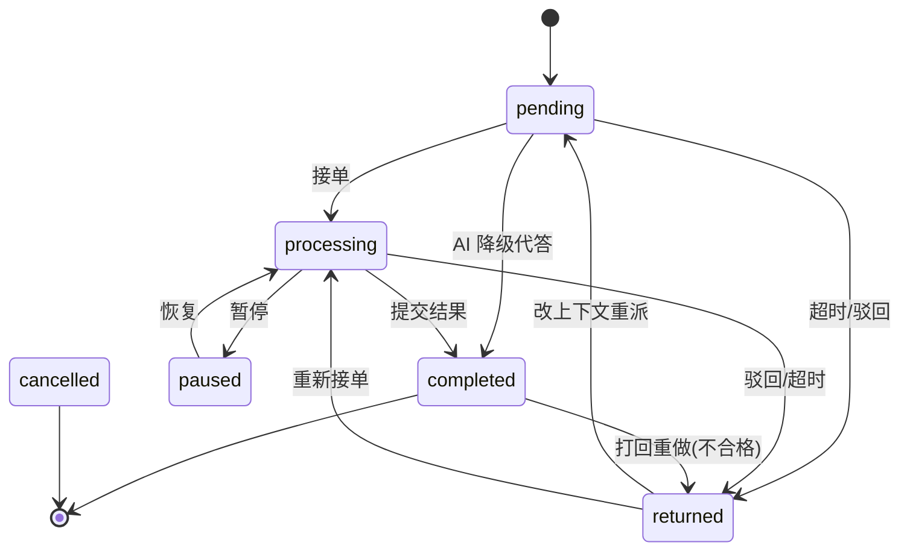

# P390 · 技术架构

> 人工代理网关（Human-as-LLM）。Node.js + Express + Socket.IO + PostgreSQL。

## 一、技术栈

| 层 | 选型 |
|---|---|
| 后端 | Node.js + Express 4 + Socket.IO |
| 数据库 | PostgreSQL 5433（库 `p390`，8 张表） |
| 认证 | JWT（jsonwebtoken + bcryptjs），admin / engineer 双角色 |
| 前端 | Vanilla HTML/JS/CSS（IIFE 模块，SVG 图标，4 主题，响应式，中英 i18n） |
| AI 中继 | 原生 `fetch`（OpenAI 兼容，一次 + stream 透传） |
| 通知 | notifier（邮件 nodemailer + Webhook，均可配置，未配置降级） |
| 安全 | 基础头 + CORS + 限流（按项目约定禁 CSP/HSTS） |

## 二、目录结构

```
server.js            # 入口：Socket.IO 认证 + 安全头 + 路由 + 启动双扫描器
├── middleware/       # auth(JWT+角色+租户key) / security(头+CORS+限流)
├── db/               # index(连接+建表+迁移) / adapters/{pg,mysql,sqlite} / dialect
├── routes/           # v1(OpenAI) approvals projects tasks workbench auth users logs
│                     #   rules(分级配置) tenants(租户) gateway(多工具安装) audit prd index
├── services/         # 业务核心（见下）
│   ├── stateMachine.js    # 状态机单例（任务/审批转换表 + 校验）
│   ├── waiters.js         # 等待者单例工厂（审批挂起等待/唤醒/超时）
│   ├── queueService.js    # 任务状态机流转 + 分级定级 + AI 降级 + 质量校验 + 30s 超时扫描
│   ├── categoryEngine.js  # 分级策略引擎（规则白名单锁死 > 上游显式 > 默认 general）
│   ├── aiShift.js         # 智能漂移（general 简单任务 AI 承接，confidential/ops 锁死）
│   ├── approvalService.js # 审批状态机 + 挂起等待 + 60s 超时提醒(24h)
│   ├── aiRelay.js         # DeepSeek 中继（shouldRelay/chat/relayStream）
│   ├── openaiEncoder.js   # OpenAI 响应 / SSE chunk 封装
│   ├── projectService.js  # 项目 CRUD + 审批批准回调
│   ├── notifier.js / mailer.js  # 通知（邮件 + Webhook），可降级
│   ├── i18n.js / csv.js   # 消息翻译 / CSV 导出
│   └── websocket.js       # Socket.IO 推送
├── public/           # login/index/workbench.html + landing/ + css + js(utils/api/ws/ui/app/i18n)
├── scripts/          # seed.js（建表+种子） demo-client.js（调度池演示） smoke-test.js check-secret.js
├── data/             # 运行时文件（gateway 配置/生成文件等，gitignore）
└── docs/             # PROJECT_OVERVIEW / API / ARCHITECTURE / GOVERNANCE 等
```

## 三、核心机制

### 1. 请求生命周期（模型名路由 → 等待者 → 结果回传）



> 任务为小时级，`/v1/chat/completions` **异步受理**（立即返回 `task_id`，不挂起），上游凭 `GET /v1/tasks/:id` 轮询取回人工产出。审批（分钟级）才走挂起等待，见「等待者」。

### 2. 任务状态机（单例 stateMachine）



### 3. 交互模式：任务异步回查、审批挂起等待

- **任务（`/v1/chat/completions`）**：人工为小时级，异步受理——创建任务后立即返回 `task_id`，上游 `GET /v1/tasks/:id` 轮询取结果，不阻塞请求（`routes/v1.js`）。SSE 请求也只回受理信息即结束。
- **审批（`/v1/approvals`）**：人类响应为分钟级，`approvalService.waitForApproval(id, timeout)` 挂起等待，批准/驳回后 `waiters.resolve` 唤醒返回。
- 超时 → `onTimeout()` 返回兜底（`timedOut: true`）。
- 审批使用 `createWaiterStore()` 实例（id 为自增数字）；任务不使用等待者。

### 4. 双扫描器

| 扫描器 | 间隔 | 逻辑 |
|---|---|---|
| `queueService.startTimeoutScanner()` | 30s | 待接单超时 → AI 降级代答（失败回落 returned）；处理中超时 → returned |
| `approvalService.startApprovalScanner()` | 60s | 待审批超 24h → 广播 `approval:overdue` 提醒 |

### 5. 模型名路由

`routes/v1.js`：解析请求 → `aiRelay.shouldRelay(model)`：
- 命中 `AI_RELAY_MODELS`（如 `deepseek-v4-flash`）→ 中继转发真实 LLM（一次 `chat()` / SSE `relayStream()` 透传）；
- 否则走人工：`createTaskFromRequest`（分级定级 + 创建 pending）→ **异步受理返回 `task_id`** → 上游轮询 `GET /v1/tasks/:id` 取回人工产出。

### 6. 质量闭环

- **提交校验**：`completeTask` 先过 `qualityCheck`（空 / 过短<20 字 / 占位词 → 拦截 400）。
- **打回重做**：`completed → returned`（`reopenTask`），清空结果重新派发。
- **审计留痕**：`task_logs` 记录每一步（create/claim/complete/reject/reopen/timeout…）。

### 7. 实时推送

Socket.IO 房间模型（`user:*` / `admin` / `system`），事件：
- `task:new` / `task:update` / `task:timeout`
- `approval:new` / `approval:update` / `approval:overdue`

前端收到 → toast + 自动刷新（`public/js/ws.js` → `app.js`）。

## 四、数据模型（PostgreSQL / 库 p390）

| 表 | 关键字段 | 用途 |
|---|---|---|
| `users` | username, email, password, role(admin/engineer), name, is_active | 账户 |
| `tasks` | upstream_request_id, model, stream, priority, project_code, request_payload(JSONB), status, assignee_id, result_text, reject_reason, timeout_at, completed_at | 人工任务 |
| `task_logs` | task_id, action, old_value(JSONB), new_value(JSONB), actor_name, remark | 状态审计 |
| `request_logs` | task_id, direction(in/out), payload(JSONB), model | 请求/输出日志 |
| `approvals` | approval_no, type(resource/project), resource, amount, purpose, detail, status(pending/approved/rejected), provider_name, provided, reject_reason, decided_at | 审批单 |
| `projects` | code(unique), name, description, status(active/archived), created_by | 项目 |
| `task_rules` | name, category(general/confidential/ops), match_field(content/project/meta_tags), keywords, priority, enabled, tenant_id | 分级策略规则（白名单锁死） |
| `tenants` | code, name, upstream_key | 租户（上游 API key 路由租户） |

**关系**：`tasks.project_code` → `projects.code`（列表 join 出 `project_name`）；`users/tasks/approvals/projects.task_rules.tenant_id` → `tenants.id`；`tasks.rule_id` → `task_rules.id`（分级理由留痕）；`approvals.type=project` 批准后自动写入 `projects`。

## 五、关键设计点

1. **上游零改动**：调度池只加一条模型路由（`human-llm` / `deepseek-v4-flash`）即接入，无需区分人工/AI。
2. **双通道更新兼容**：`transition()` 的 update 值支持 `{__expr:'NOW()…'}`（拼 SQL 表达式）与参数绑定两种，避免注入且能写 `NOW()`/`interval`。
3. **数据库适配器**：`db.exec()→[{columns,values}]`、`db.run()→{changes,lastId}`，PG 自动 `?→$n` 与 `RETURNING id`；`CREATE TABLE IF NOT EXISTS` + `ALTER TABLE ADD COLUMN IF NOT EXISTS` 做兼容迁移。
4. **humanllm 子代理**（`.claude/agents/humanllm.md`）：任务包模板（【任务】【交人工原因】【项目与代码库】【接单流程】【环境约定】【要求】）+ 资源审批预检（第 0 步）。
